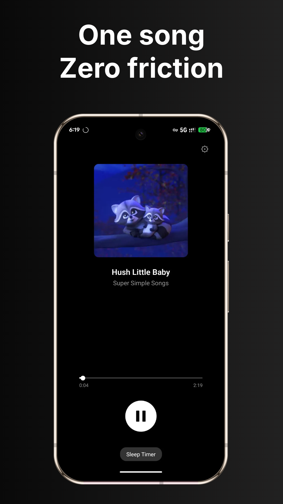
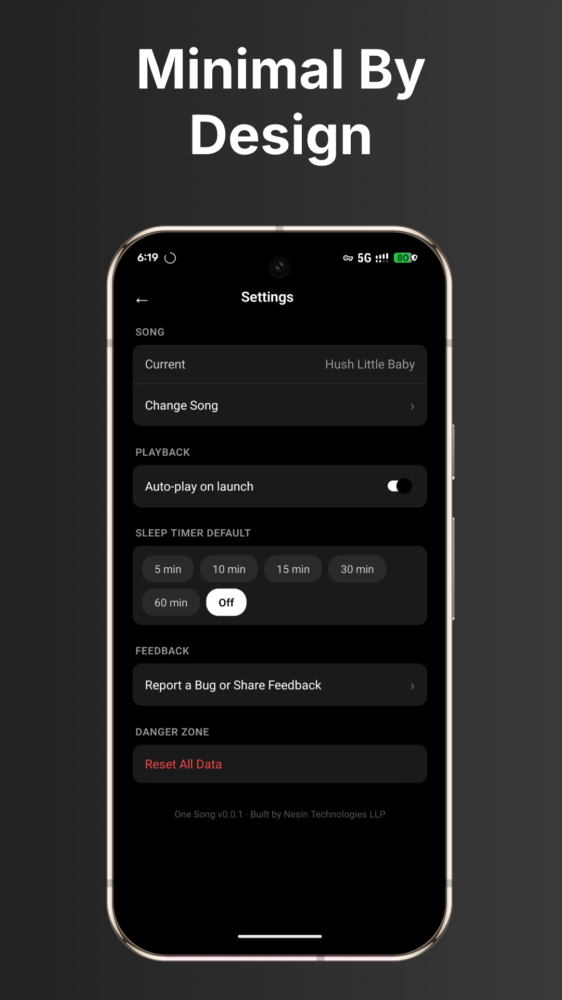

# One Song

<p align="center">
  
</p>

A minimal Android music player that plays exactly one song — on repeat, with a sleep timer, and background playback.

## What It Is

One Song is intentionally simple. Pick one audio file from your device, and the app plays it continuously. No playlists, no libraries, no complexity. Just your song, always ready.

## Features

- **Instant Playback** — Open the app and your song starts playing. No taps needed.
- **Loops Forever** — Your song repeats automatically until you say stop.
- **Sleep Timer** — Set it and forget it. 5 to 60 minutes, your choice. Configure a default in Settings.
- **Background Audio** — Music keeps playing while locked or in other apps.
- **Notification Controls** — Play, pause, or stop from the lock screen and notification shade.
- **Remembers Your Song** — Even if you move or rename the original file.
- **Seekable Progress Bar** — Tap or drag to jump anywhere in the song.
- **Change Song Anytime** — Go to Settings → Change Song to pick a different track.

## Screenshots

<p align="center">
  
  
</p>

## Tech Stack

| Layer | Technology |
|---|---|
| Framework | React Native 0.85 |
| Language | TypeScript |
| Audio Engine | react-native-track-player |
| Navigation | React Navigation (Native Stack) |
| State Persistence | AsyncStorage |
| File Picker | @react-native-documents/picker |
| Permissions | react-native-permissions |
| Build System | Gradle (Android) |

## Getting Started

### Prerequisites

- Node.js ≥ 22.11.0
- pnpm (or npm/yarn)
- Android Studio with SDK installed
- OpenJDK 17 (React Native's Android build does not yet support Java 25)
- A running Android emulator or a physical device with USB debugging enabled

### 1. Clone and Install

```bash
git clone <repo-url>
cd one-song
pnpm install
```

### 2. Configure Java for Android

The Android build requires OpenJDK 17. If your system default is Java 25, set this environment variable before building:

```bash
export JAVA_HOME=/opt/homebrew/opt/openjdk@17/libexec/openjdk.jdk/Contents/Home
```

On Apple Silicon Macs, the path is typically `/opt/homebrew/opt/openjdk@17`. On Intel Macs, use `/usr/local/opt/openjdk@17`.

### 3. Add Android SDK Tools to PATH

```bash
export ANDROID_HOME="$HOME/Library/Android/sdk"
export PATH="$ANDROID_HOME/emulator:$ANDROID_HOME/platform-tools:$PATH"
```

### 4. Start Metro (the JS bundler)

In one terminal tab:

```bash
pnpm dev
```

Leave this running. Metro watches your JS files and serves the bundle.

### 5. Run on Android

In a second terminal tab, with an emulator running or a device connected:

```bash
pnpm android
```

This builds the APK and installs it without spawning a separate packager window.

For a release build:

```bash
pnpm react-native run-android --mode=release
```

## Project Structure

```
OneSong/
├── android/                         # Android native project
│   ├── app/src/main/
│   │   ├── AndroidManifest.xml      # Permissions & services
│   │   └── java/io/nesin/onesong/   # MainActivity.kt, MainApplication.kt
│   └── ...
├── src/
│   ├── types/
│   │   └── index.ts                 # TypeScript interfaces (Song, TimerPreset, etc.)
│   ├── utils/
│   │   └── constants.ts             # Storage keys, timer presets, UI strings
│   ├── services/
│   │   ├── AudioService.ts          # Track player setup, playback controls, audio focus
│   │   ├── PlaybackController.ts  # Orchestrates player init, state polling, remote events
│   │   ├── SleepTimer.ts           # Active timer + persisted default preference
│   │   ├── OnboardingFlow.ts       # Permission, file pick, copy, and song persistence
│   │   ├── StorageService.ts        # AsyncStorage wrapper (song, timer, onboarding state)
│   │   └── PermissionService.ts     # Android storage permission requests
│   ├── components/
│   │   ├── ProgressBar.tsx          # Seekable playback progress bar
│   │   ├── PlayPauseButton.tsx      # Geometric play/pause icon button
│   │   └── SleepTimerButton.tsx     # Timer preset selector modal
│   ├── screens/
│   │   ├── OnboardingScreen.tsx     # First launch: pick song UI (delegates to OnboardingFlow)
│   │   ├── PlayerScreen.tsx         # Main screen: song info, controls, progress
│   │   └── SettingsScreen.tsx       # Change song, timer default, reset data
│   ├── navigation/
│   │   └── AppNavigator.tsx         # Stack navigator (Onboarding → Player → Settings)
│   └── App.tsx                      # Entry point: initializes track player
├── TIL.md                           # Running log of bugs, fixes, and lessons learned
├── PLAN.md                          # Original implementation plan
└── package.json
```

## Documentation

- [Architecture Notes](./docs/architecture.md) — Technical details about audio focus, file persistence, sleep timer, and app behavior
- [Troubleshooting](./docs/troubleshooting.md) — Common issues and fixes
- [Building for Production](./docs/building.md) — Release build instructions

See also [`TIL.md`](./TIL.md) for detailed write-ups of every bug and fix encountered during development.

## License

MIT
