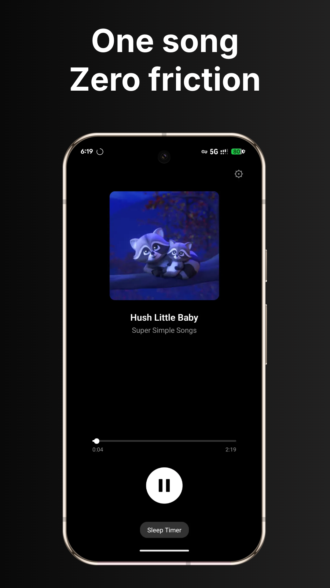
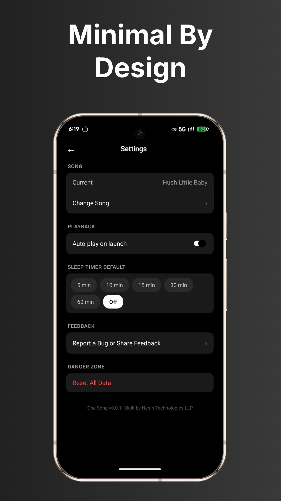

# One Song

<p align="center">
  
  <br>
  <a href="https://play.google.com/store/apps/details?id=io.nesin.onesong">
    
  </a>
</p>

A minimal music player that plays exactly one song — on repeat, with a sleep timer, and background playback. Available on Android. iOS support is in active development.

## What It Is

One Song is intentionally simple. Pick one audio file from your device, and the app plays it continuously. No playlists, no libraries, no complexity. Just your song, always ready.

## Features

- **Instant Playback** — Open the app and your song starts playing. No taps needed.
- **Loops Forever** — Your song repeats automatically until you say stop.
- **Sleep Timer** — Set it and forget it. 5 to 60 minutes, your choice. Configure a default in Settings.
- **Background Audio** — Music keeps playing while locked or in other apps.
- **Notification Controls** — Play, pause, or stop from the lock screen and notification shade.
- **Remembers Your Song** — Even if you move or rename the original file.
- **Seekable Progress Bar** — Tap or drag to jump anywhere in the song.
- **Change Song Anytime** — Go to Settings → Change Song to pick a different track.

## Screenshots

<p align="center">
  
  
</p>

## Tech Stack

| Layer | Technology |
|---|---|
| Framework | React Native 0.85 |
| Language | TypeScript |
| Audio Engine | react-native-track-player |
| Navigation | React Navigation (Native Stack) |
| State Persistence | AsyncStorage |
| File Picker | @react-native-documents/picker |
| Permissions | react-native-permissions |
| Build System | Gradle (Android) · Xcode (iOS) |

## Getting Started

### Prerequisites

- Node.js ≥ 22.11.0
- pnpm (or npm/yarn)
- Android Studio with SDK installed
- OpenJDK 17 (React Native's Android build does not yet support Java 25)
- A running Android emulator or a physical device with USB debugging enabled

### 1. Clone and Install

```bash
git clone <repo-url>
cd one-song
pnpm install
```

### 2. Configure Java for Android

The Android build requires OpenJDK 17. If your system default is Java 25, set this environment variable before building:

```bash
export JAVA_HOME=/opt/homebrew/opt/openjdk@17/libexec/openjdk.jdk/Contents/Home
```

On Apple Silicon Macs, the path is typically `/opt/homebrew/opt/openjdk@17`. On Intel Macs, use `/usr/local/opt/openjdk@17`.

### 3. Add Android SDK Tools to PATH

```bash
export ANDROID_HOME="$HOME/Library/Android/sdk"
export PATH="$ANDROID_HOME/emulator:$ANDROID_HOME/platform-tools:$PATH"
```

### 4. Start Metro (the JS bundler)

In one terminal tab:

```bash
pnpm dev
```

Leave this running. Metro watches your JS files and serves the bundle.

### 5. Run on Android

In a second terminal tab, with an emulator running or a device connected:

```bash
pnpm android
```

This builds the APK and installs it without spawning a separate packager window.

For a release build:

```bash
pnpm react-native run-android --mode=release
```

### iOS Development

iOS support is in active development. You'll need a Mac with Xcode.

#### Prerequisites

- macOS with Xcode 16+ (from the Mac App Store)
- CocoaPods (`brew install cocoapods` or `gem install cocoapods`)
- An Apple ID (free or paid) for code signing

#### 1. Install CocoaPods Dependencies

```bash
cd ios && pod install && cd ..
```

This only needs to be run once (or when native dependencies change).

#### 2. Start Metro

```bash
pnpm dev
```

#### 3. Run on iOS Simulator

```bash
pnpm ios
```

This builds and launches the app in the default iOS Simulator. To pick a specific device:

```bash
pnpm react-native run-ios --simulator "iPhone 16 Pro"
```

#### 4. Run on Physical iPhone

Open `ios/OneSong.xcworkspace` in Xcode:

1. Select **OneSong** in the project navigator
2. Go to **Signing & Capabilities** → select your team
3. Connect your iPhone via USB and select it as the run target
4. Press **Run** (▶) or use `pnpm react-native run-ios --device "Your iPhone"`

#### Known iOS Caveats

- File system APIs (`react-native-fs`, `@react-native-documents/picker`) need iOS-specific testing
- Audio focus and background playback behavior may differ from Android
- Some services (like `InAppUpdateService`) are Android-only and guarded by platform checks

## Project Structure

```
OneSong/
├── android/                              # Android native project
│   ├── app/src/main/
│   │   ├── AndroidManifest.xml           # Permissions & services
│   │   └── java/io/nesin/onesong/        # MainActivity.kt, MainApplication.kt
│   └── ...
├── ios/                                  # iOS native project
│   ├── OneSong/
│   │   ├── AppDelegate.swift             # App entry point
│   │   ├── Info.plist                    # App config & permissions
│   │   └── Images.xcassets/              # App icons & launch logo
│   └── Podfile                           # CocoaPods dependencies
├── src/
│   ├── types/
│   │   ├── index.ts                      # TypeScript interfaces (Song, TimerPreset, etc.)
│   │   └── navigation.ts                # Navigation param types
│   ├── utils/
│   │   ├── constants.ts                  # Storage keys, timer presets, UI strings
│   │   └── metadata.ts                  # ID3 + MP4 metadata extraction
│   ├── hooks/
│   │   ├── useSleepTimer.ts             # Timer state hook
│   │   └── useSettings.ts              # Settings screen state
│   ├── services/
│   │   ├── Playback.ts                  # Core playback state machine
│   │   ├── PlaybackController.ts        # React bridge for playback state
│   │   ├── AudioService.ts              # Track player setup, playback controls, audio focus
│   │   ├── SleepTimer.ts                # Active timer + persisted default preference
│   │   ├── SongIntake.ts                # Permission, file pick, copy, metadata, and song persistence
│   │   ├── MetadataAdapter.ts           # ID3 + MP4 tag parsing adapters
│   │   ├── StorageService.ts            # AsyncStorage wrapper (song, timer, onboarding state)
│   │   ├── PermissionService.ts         # Android storage permission requests
│   │   └── InAppUpdateService.ts        # Play Store in-app update flow
│   ├── components/
│   │   ├── ProgressBar.tsx              # Seekable playback progress bar
│   │   ├── PlayPauseButton.tsx          # Geometric play/pause icon button
│   │   ├── SleepTimerButton.tsx         # Timer preset selector modal
│   │   └── TimerPresetPicker.tsx        # Timer duration chip picker
│   ├── screens/
│   │   ├── OnboardingScreen.tsx         # First launch: pick song UI
│   │   ├── PlayerScreen.tsx             # Main screen: song info, controls, progress
│   │   └── SettingsScreen.tsx           # Change song, timer default, reset data
│   ├── navigation/
│   │   └── AppNavigator.tsx             # Stack navigator (Onboarding → Player → Settings)
│   ├── App.tsx                          # Entry point: initializes track player
│   └── index.js                         # App bootstrap: registers TrackPlayer service
├── docs/
│   ├── architecture.md                   # Audio focus, file persistence, sleep timer details
│   ├── building.md                       # Release build instructions
│   ├── local-development.md              # Device testing setup and workflow
│   ├── troubleshooting.md                # Common issues and fixes
│   ├── DESIGN.md                         # Color palette and design system
│   ├── PLAN.md                           # Original implementation plan
│   ├── PRD.md                            # Product requirements document
│   └── APP_STORE.md                      # Google Play Store listing assets
├── scripts/                              # Build and version automation
├── AGENTS.md                             # LLM context for coding assistants
├── TIL.md                                # Running log of bugs, fixes, and lessons learned
└── package.json
```

## Documentation

- [Architecture Notes](./docs/architecture.md) — Technical details about audio focus, file persistence, sleep timer, and app behavior
- [Troubleshooting](./docs/troubleshooting.md) — Common issues and fixes
- [Building for Production](./docs/building.md) — Release build instructions

See also [`TIL.md`](./TIL.md) for detailed write-ups of every bug and fix encountered during development.

## License

MIT
